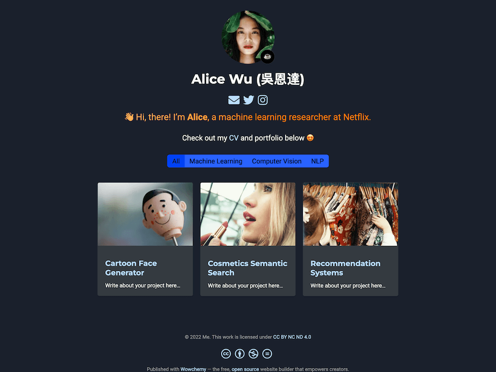

# M-SE0K Portfolio (Hugo + HugoBlox/Wowchemy)

안녕하세요, 권민석(M-SE0K)입니다. 문제를 구조적으로 분석하고 꾸준히 개선하는 것을 즐깁니다. 사용자 경험을 해치지 않는 범위에서 성능과 유지보수를 우선시하며, 기록과 자동화를 습관화하고 있습니다.

개인 포트폴리오 사이트 저장소입니다. HugoBlox 기반으로 다국어(ko/en), 커스텀 메뉴, 테마 컬러, SCSS 오버라이드 등을 사용합니다.



## 빠른 시작

개발 서버 실행:

```bash
tools/hugo/bin/hugo server -D
```

프로덕션 빌드(정적 파일 생성 → `public/`):

```bash
tools/hugo/bin/hugo --minify
```

## 주요 경로(커스터마이징)

- 메뉴 구성: `config/_default/menus.yaml`
  - 상위/하위 메뉴 추가, `identifier`/`parent`로 드롭다운 구성

- 다국어/사이트 타이틀: `config/_default/languages.yaml`
  - `ko.title`, `en.title` 값 변경으로 헤더 타이틀 텍스트 수정

- 헤더 옵션: `config/_default/params.yaml`
  - `header.navbar.show_logo: true` 로고 표시, 검색/라이트/다크 버튼 등 토글

- 테마 색상: `data/themes/custom.toml`
  - `[light].primary`, `menu_text_active`, `[dark].primary` 등 포인트 컬러 설정

- SCSS 오버라이드: `assets/scss/template.scss`
  - 네비/드롭다운 호버, 글꼴 색, 로고 크기 등 스타일 커스터마이즈

- 로고/아이콘 이미지: `assets/media/icon.png`
  - 정사각 PNG(sRGB, 256~512px)로 교체하면 헤더 아이콘/파비콘이 갱신됩니다

- 컨택트 배경(ko/en): `content/ko/contact/index.md`, `content/en/contact/index.md`
  - 섹션의 `design.background.image.filename` 에 배경 이미지 지정 (예: `contact.png`)
  - 투명도 `image_darken`, 텍스트 가독성 `text_color_light` 조절

## 이미지 사용 주의(빌드 오류 예방)

Hugo 이미지 파이프라인에서 "unknown format" 오류가 발생하면 아래처럼 재인코딩하세요.

PNG 재인코딩(권장):

```bash
magick assets/media/contact.png -strip -colorspace sRGB -define png:color-type=2 -depth 8 assets/media/contact.png
```

JPG 재인코딩(슬라이더 이미지 등):

```bash
magick assets/media/Slider/img1.jpg -strip -interlace none -colorspace sRGB -quality 90 assets/media/Slider/img1.jpg
```

WebP로 변환하여 용량 절감:

```bash
magick assets/media/contact.png -strip -quality 90 assets/media/contact.webp
# 그런 다음 content의 filename을 contact.webp 로 변경
```

## 배포

- Netlify 사용 시 `netlify.toml` 기준으로 자동 배포됩니다.
- 수동 배포는 `public/` 폴더를 정적 호스팅에 업로드하세요.

## 라이선스

개인 포트폴리오 용도로 사용됩니다. 테마는 HugoBlox/Wowchemy에 의해 제공됩니다.Commit count: 1 at 2025년 10월  7일 화요일 19시 27분 30초 KST
Commit count: 2 at 2025년 10월  7일 화요일 19시 27분 32초 KST
Commit count: 3 at 2025년 10월  7일 화요일 19시 27분 34초 KST
Commit count: 4 at 2025년 10월  7일 화요일 19시 27분 37초 KST
Commit count: 5 at 2025년 10월  7일 화요일 19시 27분 39초 KST
Commit count: 6 at 2025년 10월  7일 화요일 19시 27분 41초 KST
Commit count: 7 at 2025년 10월  7일 화요일 19시 27분 44초 KST
Commit count: 8 at 2025년 10월  7일 화요일 19시 27분 46초 KST
Commit count: 9 at 2025년 10월  7일 화요일 19시 27분 48초 KST
Commit count: 10 at 2025년 10월  7일 화요일 19시 27분 50초 KST
Commit count: 11 at 2025년 10월  7일 화요일 19시 27분 53초 KST
Commit count: 12 at 2025년 10월  7일 화요일 19시 27분 55초 KST
Commit count: 13 at 2025년 10월  7일 화요일 19시 27분 57초 KST
Commit count: 14 at 2025년 10월  7일 화요일 19시 28분 00초 KST
Commit count: 15 at 2025년 10월  7일 화요일 19시 28분 02초 KST
Commit count: 16 at 2025년 10월  7일 화요일 19시 28분 04초 KST
Commit count: 17 at 2025년 10월  7일 화요일 19시 28분 07초 KST
Commit count: 18 at 2025년 10월  7일 화요일 19시 28분 09초 KST
Commit count: 19 at 2025년 10월  7일 화요일 19시 28분 12초 KST
Commit count: 20 at 2025년 10월  7일 화요일 19시 28분 14초 KST
Commit count: 21 at 2025년 10월  7일 화요일 19시 28분 16초 KST
Commit count: 22 at 2025년 10월  7일 화요일 19시 28분 19초 KST
Commit count: 23 at 2025년 10월  7일 화요일 19시 28분 21초 KST
Commit count: 24 at 2025년 10월  7일 화요일 19시 28분 23초 KST
Commit count: 25 at 2025년 10월  7일 화요일 19시 28분 25초 KST
Commit count: 26 at 2025년 10월  7일 화요일 19시 28분 28초 KST
Commit count: 27 at 2025년 10월  7일 화요일 19시 28분 30초 KST
Commit count: 28 at 2025년 10월  7일 화요일 19시 28분 32초 KST
Commit count: 29 at 2025년 10월  7일 화요일 19시 28분 35초 KST
Commit count: 30 at 2025년 10월  7일 화요일 19시 28분 37초 KST
Commit count: 31 at 2025년 10월  7일 화요일 19시 28분 39초 KST
Commit count: 32 at 2025년 10월  7일 화요일 19시 28분 42초 KST
Commit count: 33 at 2025년 10월  7일 화요일 19시 28분 44초 KST
Commit count: 1 at 2025년 10월  7일 화요일 19시 29분 27초 KST
Commit count: 2 at 2025년 10월  7일 화요일 19시 29분 29초 KST
Commit count: 3 at 2025년 10월  7일 화요일 19시 29분 32초 KST
