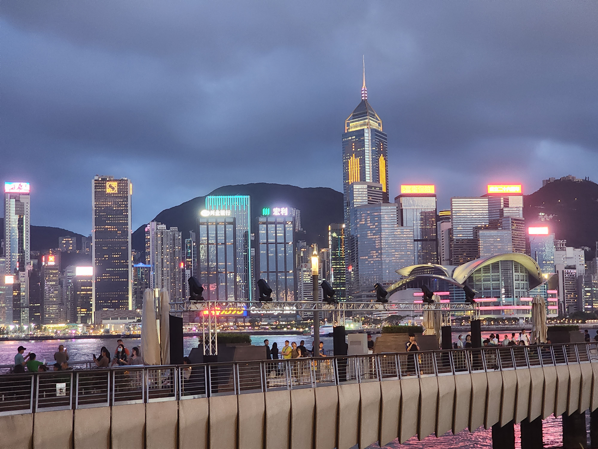
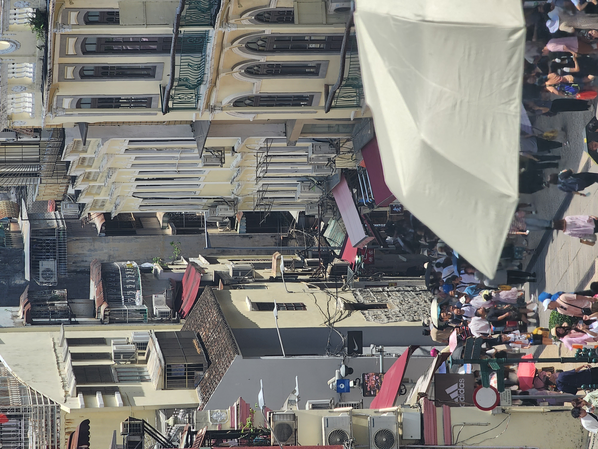
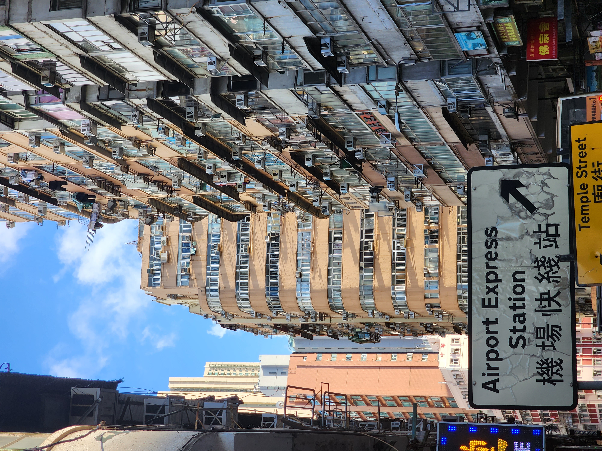
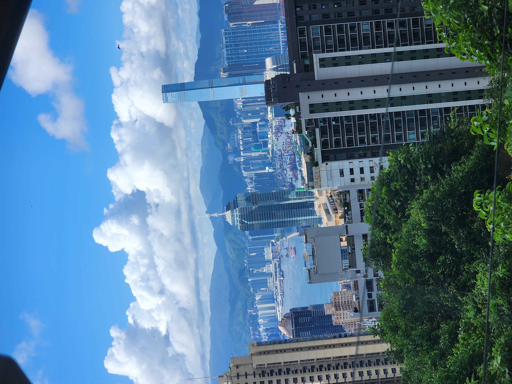
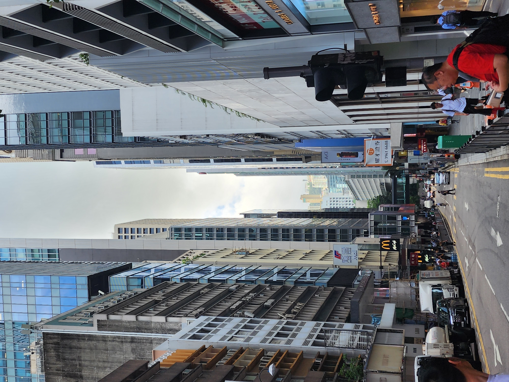

# 🇭🇰🇲🇴 Hong Kong/Macau Travel Diary

Visited Hong Kong and Macau in Spring 2025.

## 📸 Travel Cards

  
  

  

    <h3 class="card-title">Night Market 🌃</h3>
    
A traditional market in Hong Kong. Mostly frequented by Hong Kong locals, and even though I'm Korean, I was asked if I was from Hong Kong.

    

      Night View
      Traditional
      Tourist Spot
    

  

  
  

  

    <h3 class="card-title">Tsim Sha Tsui Night View 🌉</h3>
    
Beautiful night view along the harbor connecting Hong Kong Island and Kowloon Peninsula. Perfect for shopping, dining, and romantic walks.

    

      Night View
      Shopping
      Harbor
    

  

  
  

  

    <h3 class="card-title">Senado Square 🎨</h3>
    
A place where Macau's history and culture come alive. Portuguese colonial architecture harmoniously blends with modern shops in this UNESCO World Heritage site.

    

      History
      World Heritage
      Architecture
    

  

  
  

  

    <h3 class="card-title">Macau Historic Site</h3>
    
Visited a historic site in Macau. It was really big and beautiful. I was very happy that there were no Koreans there at all.

    

      Macau
      Traditional
      Experience
    

  

  
  

  

    <h3 class="card-title">Hong Kong Buildings 🥧</h3>
    
This is said to be the main living space for Hong Kong people. Housing prices are expensive and it's said to be more crude than Korean studio apartments.

    

      Architecture
      Traditional
      Local Life
    

  

  
  

  

    <h3 class="card-title">Viewpoint</h3>
    
A tram heading to Hong Kong's viewpoint. The tram was very fun and Hong Kong viewed from above was truly beautiful.

    

      Hong Kong
      View
      Viewpoint
    

  

  
  

  

    <h3 class="card-title">Street in front of accommodation</h3>
    
The street in front of our accommodation. Multiple buildings are connected, so even in the hot summer, I was happy to walk while feeling the air conditioning breeze.

    

      Hong Kong
      View
      Air Conditioning
    

  

## 📝 Travel Review

Experienced the harmonious blend of Eastern and Western cultures while traveling Hong Kong and Macau together.

### Main Attractions
- **Victoria Peak**: Hong Kong's night view
- **Tsim Sha Tsui**: Shopping and night view spot
- **Senado Square**: Portuguese-style architecture in Macau

### Recommended Food
- Dim Sum
- Egg Tart
- Wonton Noodles

