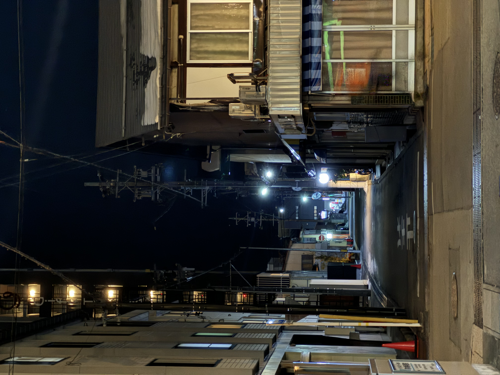
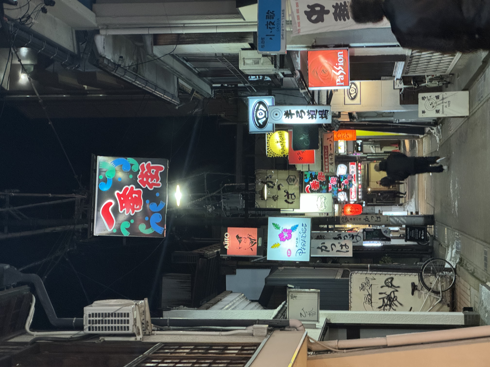
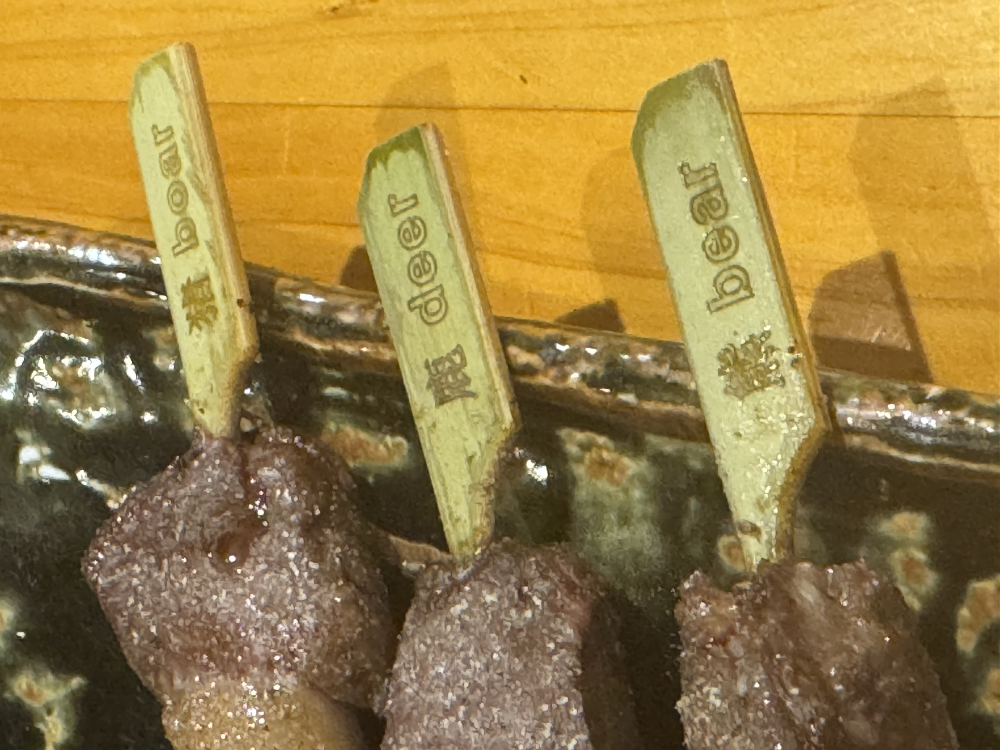
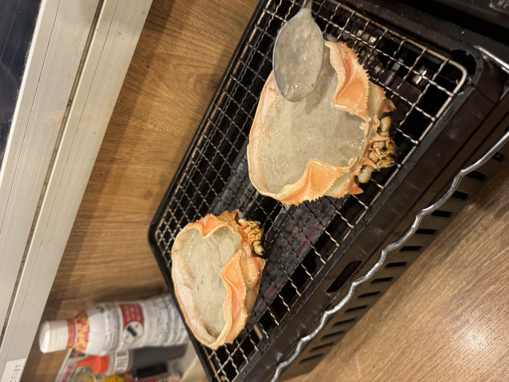
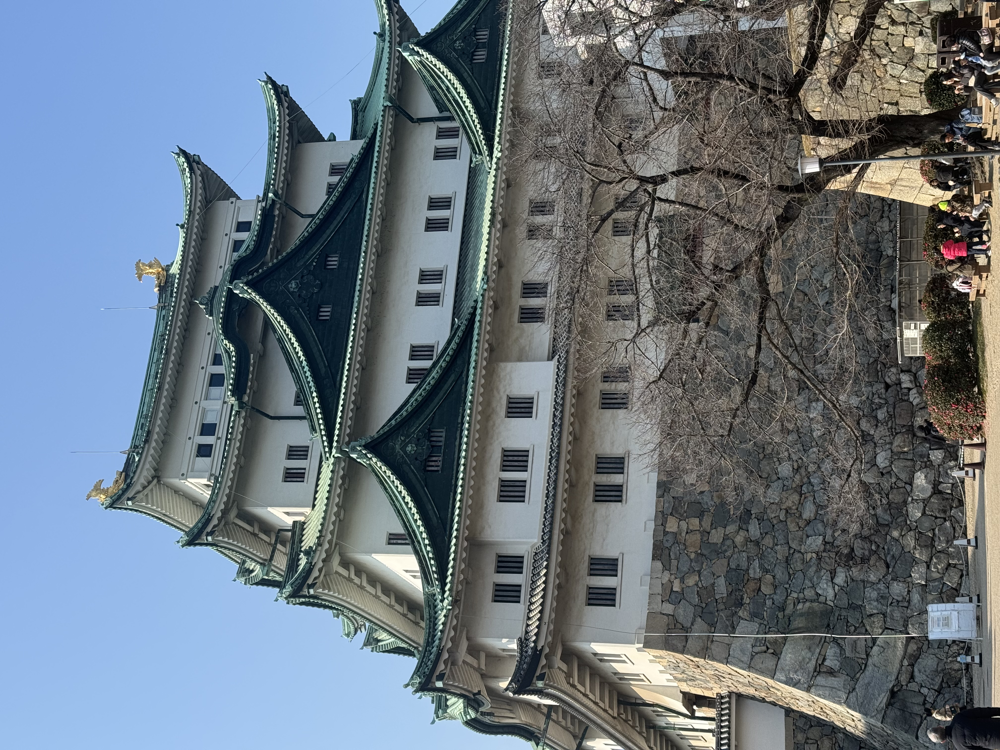

---
---

### Visited Nagoya, Japan in Winter 2024.

  

    
     
Nagoya Castle

  

  

    
     
Osu Shopping District

  

  

    
     
Hitsumabushi

  

  

    
     
Skewers

  

  

    
     
Bear Meat Hot Pot

  

  

    
     
Takayama

  

  

    
     
Crab Shell

  

  

    
     
Sashimi

  

  
  

    <video width="100%" height="100%" style="border-radius: 4px; object-fit: cover; min-height: 200px; max-height: 450px;" controls>
      <source src="video.mp4" type="video/mp4">
      Your browser does not support the video tag.
    </video>
     
Nagoya Travel Video

  

  

    
     
Back Alley

  

  

    
     
Nagoya Castle

  

  
  

      
     
Miso Katsu

  

## 📝 Travel Review

Nagoya is a city with many attractions while being less crowded than Tokyo or Osaka.

### Main Attractions
- **Nagoya Castle**: Impressive golden shachihoko
- **Osu Shopping District**: Various food and shopping
- **Atsuta Shrine**: Historic shrine

### Recommended Food
- Hitsumabushi (Eel Rice Bowl)
- Miso Katsu (Miso Pork Cutlet)
- Tebasaki (Fried Chicken Wings)

