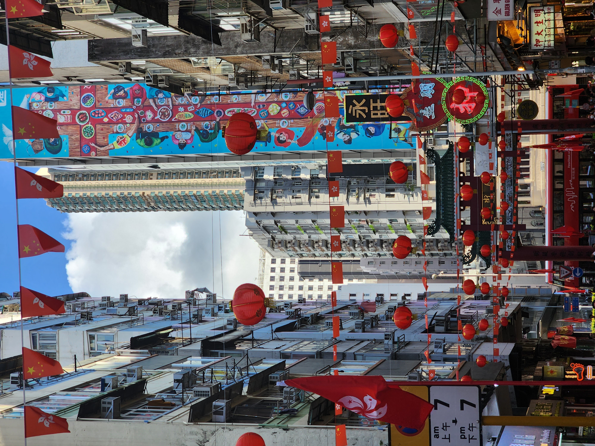
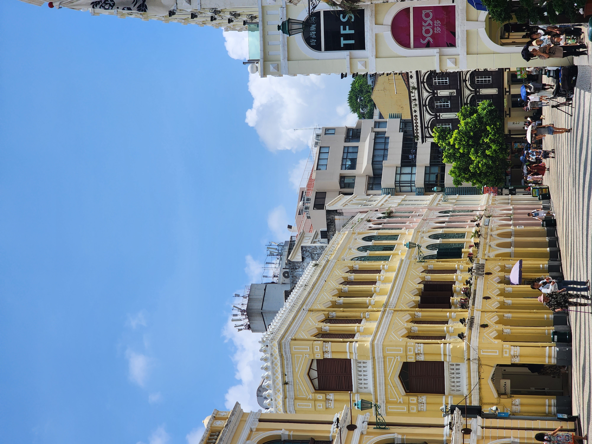

# 🇭🇰🇲🇴 홍콩/마카오 여행기

2025년 봄, 홍콩과 마카오를 다녀왔습니다.

## 📸 여행 카드

  
  

  

    <h3 class="card-title">야시장 🌃</h3>
    
홍콩의 전통 시장입니다. 홍콩 현지인들이 주로 많으며, 저는 한국인이지만 한국인에게 홍콩 사람이냐는 질문을 받아보았습니다.

    

      야경
      전통
      관광지
    

  

  
  

  

    <h3 class="card-title">침사추이 야경 🌉</h3>
    
홍콩섬과 구룡반도를 연결하는 해협을 따라 펼쳐진 아름다운 야경. 쇼핑과 식사, 그리고 낭만적인 산책을 즐길 수 있는 곳입니다.

    

      야경
      쇼핑
      해변
    

  

  
  

  

    <h3 class="card-title">세나도 광장 🎨</h3>
    
마카오의 역사와 문화가 살아 숨쉬는 곳. 포르투갈의 식민지 시대 건축물들과 현대적인 상점들이 조화롭게 어우러진 유네스코 세계문화유산입니다.

    

      역사
      문화유산
      건축
    

  

  
  

  

    <h3 class="card-title">마카오 유적지</h3>
    
마카오의 어느 유적지를 가보았습니다. 정말 크고 이뻤습니다. 한국인들이 한 명도 보이지 않아 매우 좋았습니다.

    

      마카오
      전통
      체험
    

  

  
  

  

    <h3 class="card-title">홍콩 건물 🥧</h3>
    
홍콩 사람들의 주로 생활하는 공간이라고 합니다. 집값이 비싸 한국의 원룸보다 좀 더 투박하다고 합니다.

    

      디저트
      전통
      맛집
    

  

  
  

  

    <h3 class="card-title">전망대</h3>
    
홍콩의 전망대로 향하는 트림입니다. 트림이 매우 재밌고 위에서 내려다보는 홍콩은 정말 아름다웠습니다.

    

      홍콩
      뷰
      전망대
    

  

  
  

  

    <h3 class="card-title">숙소앞 길 </h3>
    
숙소 앞 길입니다. 여러 빌딩들이 연결되어 있어 무더운 여름에도 에어컨 바람을 맞으며 걸을 수 있어서 행복했습니다.

    

      홍콩
      뷰
      에어컨
    

  

## 📝 여행 후기

홍콩과 마카오를 함께 여행하며 동서양의 문화가 조화롭게 어우러진 모습을 경험했습니다.

### 주요 방문지
- **빅토리아 피크**: 홍콩의 야경
- **침사추이**: 쇼핑과 야경 명소
- **세나도 광장**: 마카오의 포르투갈 풍 건축

### 추천 음식
- 딤섬
- 에그타르트
- 완탕면

