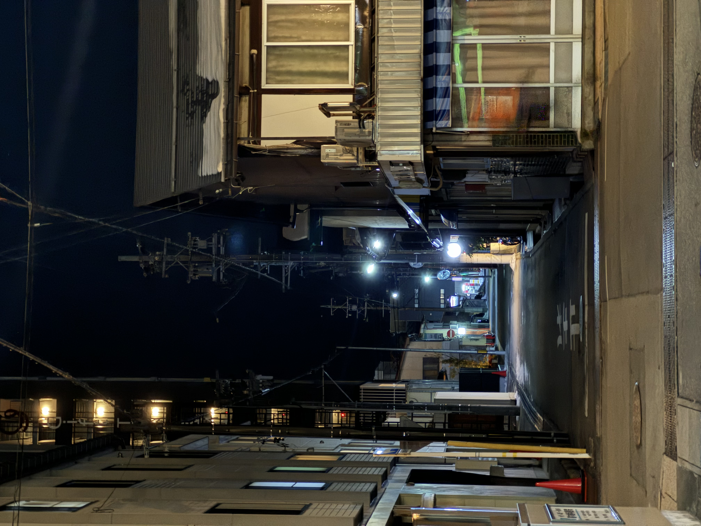
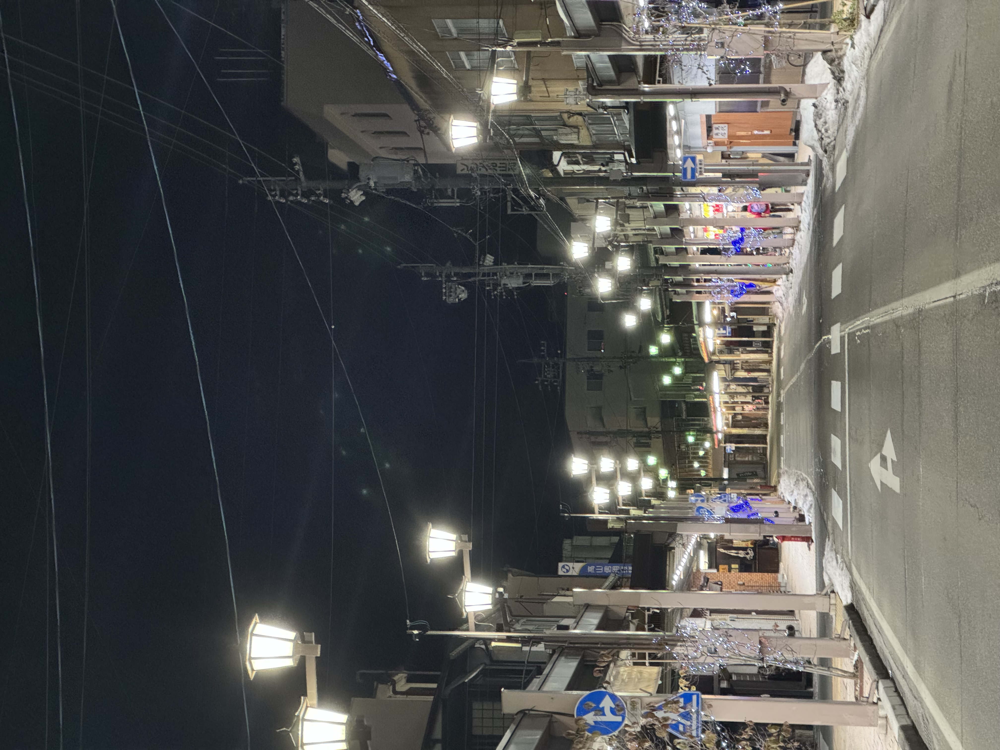
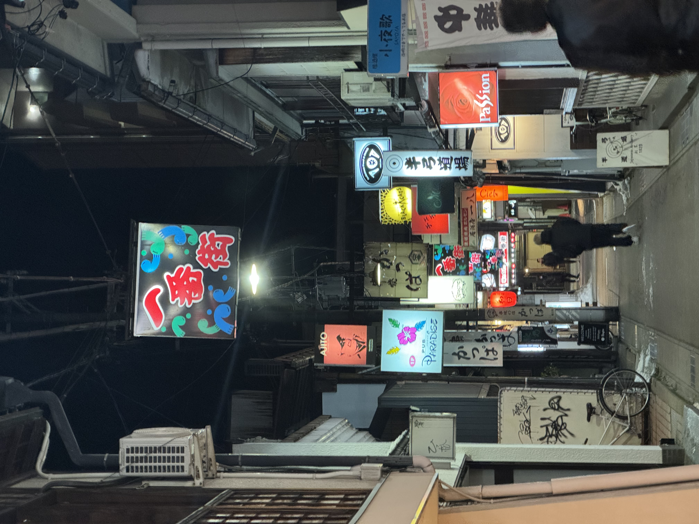
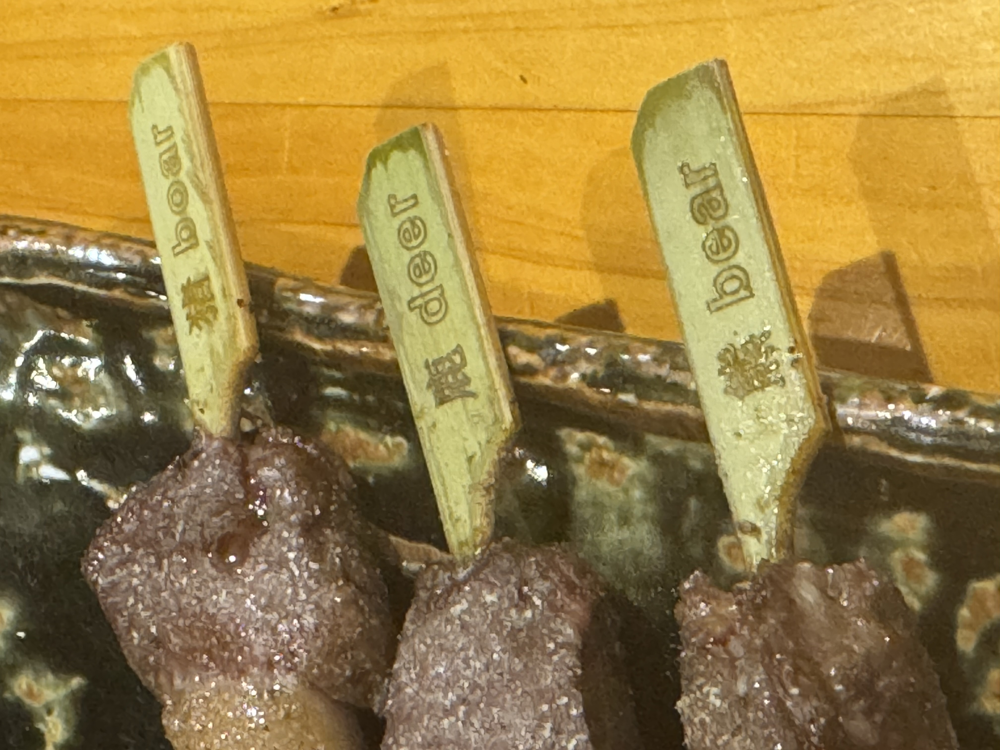
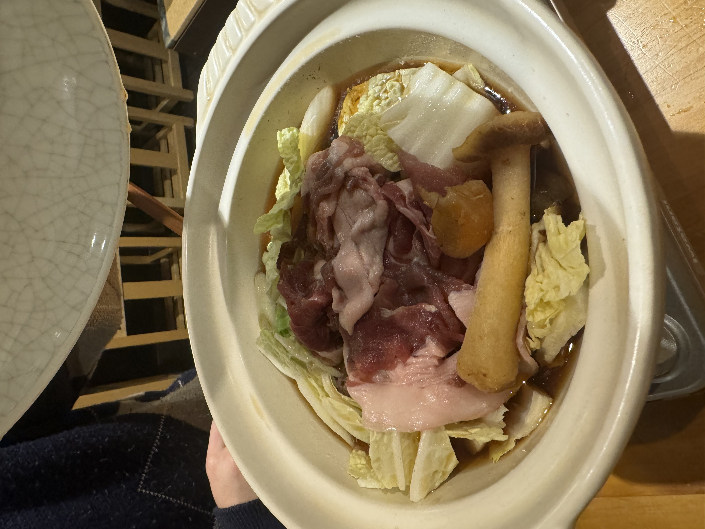
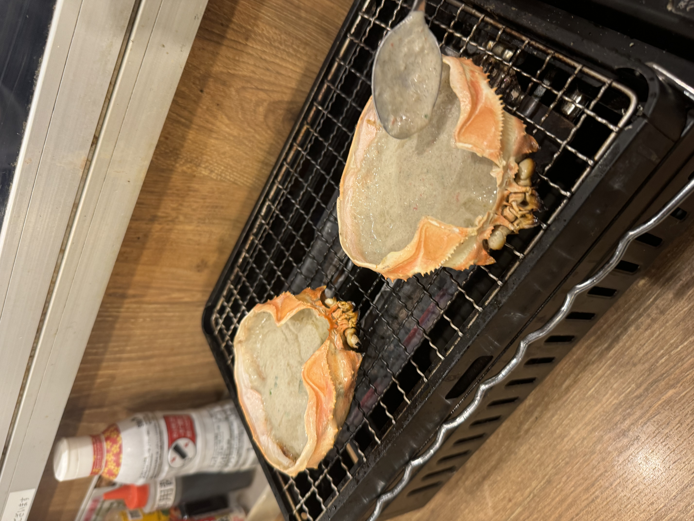
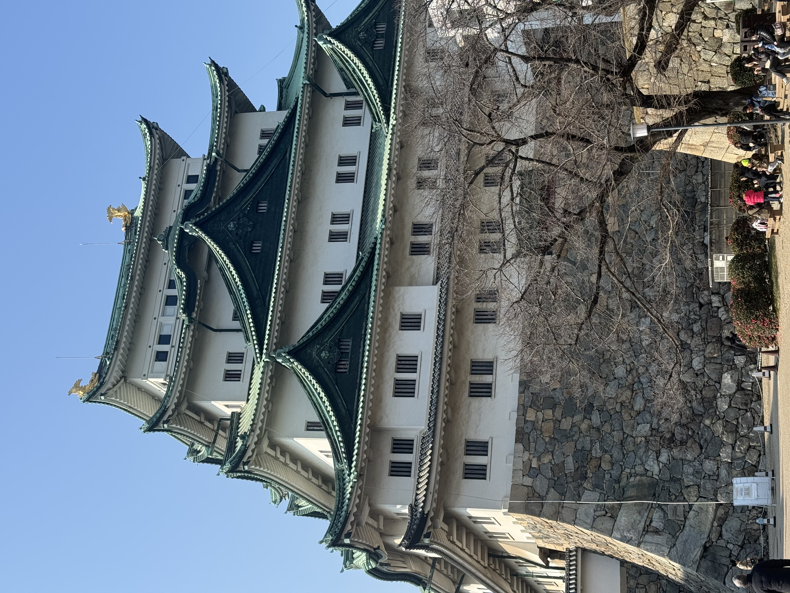

<!-- Styles imported from assets/scss/custom-cards.scss -->

### 2024년 겨울, 일본 나고야를 다녀왔습니다.

  

    
    
나고야 성

  

  

    
    
오스 상점가

  

  

    
    
히츠마부시

  

  

    
    
꼬치

  

  

    
    
곰고기 전골

  

  

    
    
다카야마

  

  

    
    
게딱지

  

  

    
    
회

  

  
  

    <video width="100%" height="100%" style="border-radius: 4px; object-fit: cover; min-height: 200px; max-height: 450px;" controls>
      <source src="video.mp4" type="video/mp4">
      브라우저가 비디오를 지원하지 않습니다.
    </video>
    
나고야 여행 영상

  

  

    
    
뒷골목

  

  

    
    
나고야성

  

  
  

      
    
된장돈가스

  

## 📝 여행 후기

나고야는 도쿄나 오사카보다 덜 붐비면서도 볼거리가 많은 도시였습니다.

### 주요 방문지
- **나고야 성**: 금색 샤치호코가 인상적
- **오스 상점가**: 다양한 먹거리와 쇼핑
- **아츠타 신궁**: 역사 깊은 신사

### 추천 음식
- 히츠마부시 (장어덮밥)
- 미소카츠 (된장 돈까스)
- 테바사키 (닭날개 튀김)

